# Parqueo — documentation fonctionnelle

Ce que fait le logiciel, écran par écran. Public visé : les utilisateurs, les
techniciens et les administrateurs fonctionnels.

- [1. À quoi sert Parqueo](#1-à-quoi-sert-parqueo)
- [2. Les trois rôles](#2-les-trois-rôles)
- [3. Se connecter](#3-se-connecter)
- [4. Le tableau de bord](#4-le-tableau-de-bord)
- [5. Créer une demande](#5-créer-une-demande)
- [6. Suivre et traiter un ticket](#6-suivre-et-traiter-un-ticket)
- [7. Le cycle de vie d'un ticket](#7-le-cycle-de-vie-dun-ticket)
- [8. La base de connaissances](#8-la-base-de-connaissances)
- [9. L'inventaire du parc](#9-linventaire-du-parc)
- [10. L'administration](#10-ladministration)
- [11. Les workflows](#11-les-workflows)
- [12. Les paramètres](#12-les-paramètres)
- [13. Les emails](#13-les-emails)
- [14. Questions fréquentes](#14-questions-fréquentes)

---

## 1. À quoi sert Parqueo

Parqueo réunit quatre usages d'un service informatique dans une seule
application :

- **le ticketing** — recevoir, suivre et clôturer les demandes ;
- **la gestion de parc** — savoir quel matériel existe, où il est, qui l'utilise
  et ce qu'il a subi ;
- **le catalogue de demandes** — des formulaires guidés pour les demandes
  récurrentes, plutôt que du texte libre ;
- **l'automatisation** — des workflows visuels qui appliquent vos procédures à
  chaque ticket, sans intervention.

Tout est installé sur vos serveurs : aucune donnée ne transite par un service
tiers.

---

## 2. Les trois rôles

| Rôle | Pour qui | Ce qu'il voit et fait |
| ---- | -------- | --------------------- |
| **Utilisateur** | tout le personnel | crée des demandes, suit **les siennes**, répond aux messages, consulte la base de connaissances |
| **Technicien** | l'équipe informatique | voit les tickets **qui lui sont assignés, non assignés, ou portés par son équipe** ; les traite, les assigne, gère l'inventaire |
| **Administrateur** | responsable du service | **tout**, plus la gestion des comptes, équipes, catégories, formulaires, workflows et paramètres |

Trois précisions qui reviennent souvent :

- **Un technicien ne voit pas tous les tickets.** Il voit les siens, ceux de son
  équipe, et ceux que personne n'a encore pris. Un ticket assigné à un
  technicien d'une autre équipe lui est invisible.
- **Un utilisateur ne voit que ses propres demandes**, jamais celles de ses
  collègues, même dans la même catégorie.
- **Un changement de rôle ne prend effet qu'à la reconnexion.** Si vous
  promouvez quelqu'un pendant qu'il travaille, demandez-lui de se déconnecter et
  de se reconnecter.

---

## 3. Se connecter

Deux modes cohabitent :

- **Compte local** — email et mot de passe créés par un administrateur.
- **Microsoft Entra ID (SSO)** — bouton « Se connecter avec Microsoft », visible
  seulement si l'administrateur a configuré le SSO. Le compte est **créé
  automatiquement à la première connexion**, avec le rôle Utilisateur.

Un compte créé par SSO n'a pas de mot de passe local : le formulaire classique
le refuse et invite à passer par Microsoft.

La session dure **7 jours**, puis il faut se reconnecter.

<figure class="etroite">
  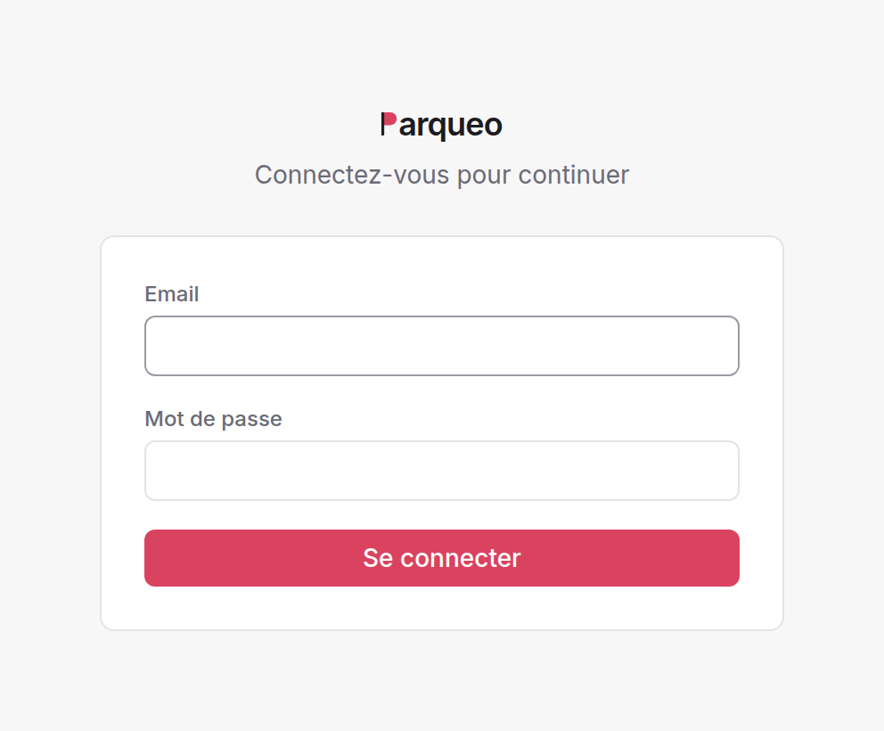
  <figcaption>L'écran de connexion. Le bouton « Se connecter avec Microsoft » n'apparaît que si le SSO est configuré.</figcaption>
</figure>

---

## 4. Le tableau de bord

C'est la page d'accueil. Elle est **modulaire** : une grille de widgets que
l'administrateur compose **par rôle**. Utilisateurs, techniciens et
administrateurs peuvent donc avoir trois tableaux de bord différents.

<figure>
  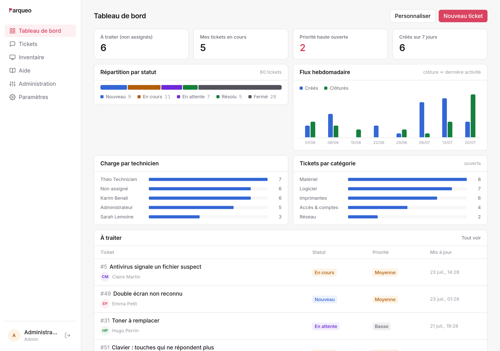
  <figcaption>Le tableau de bord d'un administrateur : tuiles de stat, répartition par statut, flux hebdomadaire, charge par technicien et file « à traiter ».</figcaption>
</figure>

### 4.1 Widgets disponibles

| Widget | Contenu |
| ------ | ------- |
| **Tuile de stat** | un chiffre clé, cliquable vers la liste filtrée correspondante |
| **Donut** | répartition par statut, catégorie, priorité, ou état du parc |
| **Répartition par statut** | barre segmentée des tickets |
| **Flux hebdomadaire** | tickets créés vs clôturés, sur 4, 8 ou 12 semaines |
| **Tickets par catégorie** | volume par catégorie (ouverts, ou tous) |
| **Tickets par priorité** | volume des tickets ouverts par priorité |
| **Charge par technicien** | tickets ouverts par assigné *(staff)* |
| **Charge par équipe** | tickets ouverts par équipe *(staff)* |
| **Âge des tickets ouverts** | depuis combien de temps ils attendent |
| **Actifs par type** | répartition de l'inventaire |
| **État du parc** | barre segmentée des actifs |
| **Liste de tickets** | liste filtrée : à traiter, assignés à moi, mes demandes, priorité haute, activité récente |
| **Liste d'actifs** | actifs récents ou en réparation |

### 4.2 Métriques des tuiles

Tickets ouverts, nouveaux tickets, à traiter (non assignés) *(staff)*, mes
tickets en cours *(staff)*, priorité haute ouverte, en attente, résolus, créés
sur 7 jours, clôturés sur 7 jours, mes tickets ouverts, actifs, actifs en
réparation.

Les métriques marquées *(staff)* n'apparaissent pas pour les utilisateurs.

### 4.3 Personnalisation

Par défaut, chacun voit le tableau de bord de son rôle, tel que
l'administration l'a défini. Celle-ci peut **autoriser la personnalisation**
séparément pour les techniciens et pour les utilisateurs (voir §12). Un tableau
de bord personnalisé est enregistré sur le compte, pas sur le navigateur : on le
retrouve à l'identique depuis un autre poste, et un bouton permet de revenir au
tableau de bord du rôle.

---

## 5. Créer une demande

Bouton **Nouvelle demande**. Trois portes d'entrée.

### 5.1 Le catalogue de demandes

La page présente les **formulaires** publiés par l'administration : « Demande
d'accès », « Nouveau matériel », « Départ d'un collaborateur »… Chaque
formulaire pose ses propres questions, et impose d'avance la catégorie et la
priorité du ticket. C'est la voie à privilégier pour tout ce qui est récurrent :
les informations utiles sont collectées du premier coup.

Types de champs possibles : texte court, texte long, liste de choix, date, case
à cocher. Un champ peut être obligatoire.

<figure>
  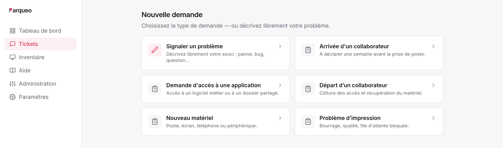
  <figcaption>Le catalogue. La demande libre reste en tête ; les formulaires publiés suivent, avec leur catégorie.</figcaption>
</figure>

<figure>
  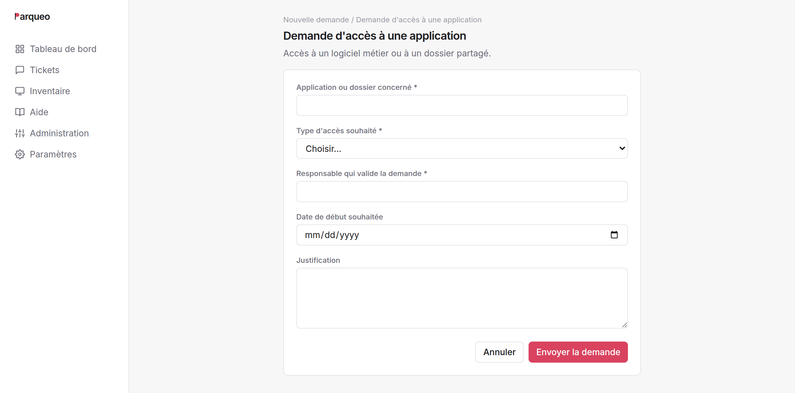
  <figcaption>Un formulaire guidé : les champs obligatoires sont signalés, la catégorie et la priorité du ticket sont déjà fixées.</figcaption>
</figure>

### 5.2 La demande libre

Pour ce qui n'entre dans aucune case : titre, description, catégorie, et
éventuellement priorité et matériel concerné.

**Suggestions automatiques** : dès que le titre fait quatre caractères, Parqueo
propose jusqu'à trois articles de la base de connaissances susceptibles de
répondre. Beaucoup de demandes s'arrêtent là — c'est l'objectif. (Cette
suggestion est débrayable.)

**Choix de la priorité** : les utilisateurs peuvent ou non fixer la priorité,
selon un paramètre. Sinon, la priorité par défaut s'applique.

**Matériel concerné** : un utilisateur peut rattacher un de ses actifs à sa
demande. L'historique du matériel se construit alors tout seul.

### 5.3 Par email

Si le collecteur email est activé, il suffit d'écrire à l'adresse du support :
le message devient un ticket, pièces jointes comprises.

Deux règles :

- **l'expéditeur doit avoir un compte Parqueo** — un email venant d'une adresse
  inconnue est ignoré ;
- **répondre à une notification ajoute un message au ticket** plutôt que d'en
  créer un nouveau, tant que le sujet contient `Ticket #n`. La citation du
  message précédent est retirée automatiquement.

---

## 6. Suivre et traiter un ticket

### 6.1 La liste des tickets

Filtres : statut (pastilles avec compteurs), priorité, assigné (dont « non
assigné »), catégorie, équipe, et recherche libre dans le titre et la
description.

Tri par clic sur l'en-tête de colonne (numéro, statut, priorité, catégorie,
assigné, dernière activité), ou par présélection : activité récente, plus
anciens, priorité haute d'abord.

Pagination réglable : 10, 25, 50, 100, 500, ou tout afficher.

Les compteurs des pastilles tiennent compte de tous vos autres filtres mais
**pas** du filtre de statut : ils affichent donc toujours la répartition
complète.

<figure>
  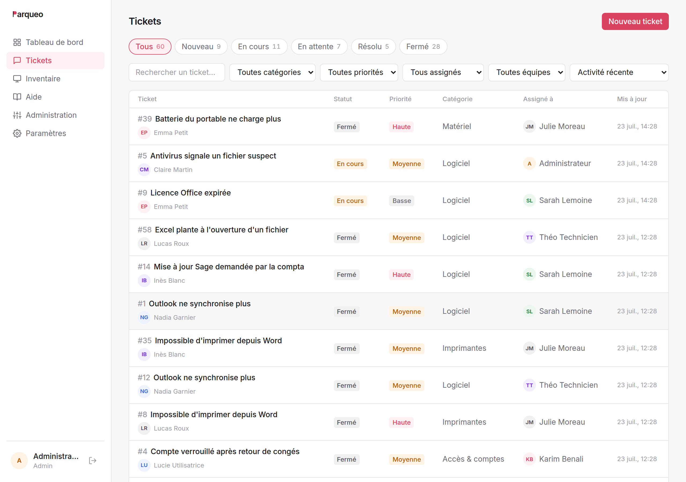
  <figcaption>La liste des tickets : pastilles de statut avec compteurs, filtres par priorité, assigné, catégorie et équipe, recherche libre.</figcaption>
</figure>

### 6.2 Le détail d'un ticket

**Le fil.** Description initiale, messages, pièces jointes et **journal
d'événements** sur une seule chronologie. Chaque changement de statut, de
priorité, d'assignation ou d'équipe y laisse une trace horodatée et nominative —
y compris quand l'auteur du changement est un workflow, qui est nommé
explicitement (« Affecté à l'équipe Support N1 (workflow « Incident réseau ») »).

**Les pièces jointes.** 10 Mo maximum par fichier ; images, PDF, documents
bureautiques, archives, journaux, CSV. Les images s'affichent en vignette
directement dans le fil.

**Le panneau latéral** *(techniciens et administrateurs)* : statut, priorité,
assigné, équipe, catégorie, matériel concerné. Chaque modification est
immédiate et journalisée.

**L'état des workflows.** Si un workflow retient le ticket, le panneau l'indique
en clair : « en attente de prise en charge », « en attente du statut
« Résolu » ». On sait donc toujours pourquoi un ticket ne bouge pas.

<figure>
  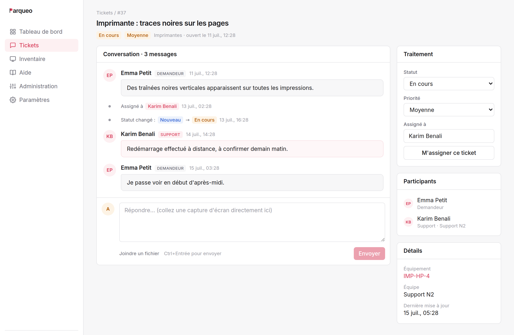
  <figcaption>Le détail d'un ticket. À gauche le fil — description, messages, pièces jointes et journal d'événements horodaté ; à droite le panneau de gestion, réservé aux techniciens et administrateurs.</figcaption>
</figure>

### 6.3 Qui peut faire quoi

| Action | Utilisateur | Technicien | Admin |
| ------ | :---------: | :--------: | :---: |
| Créer une demande | ✅ | ✅ | ✅ |
| Commenter un ticket visible | ✅ | ✅ | ✅ |
| Joindre un fichier | ✅ | ✅ | ✅ |
| Changer statut / priorité / assigné / équipe | ❌ | ✅ | ✅ |
| Modifier titre et description | ❌ | ✅ | ✅ |
| Voir les tickets des autres | ❌ | partiel | ✅ |

---

## 7. Le cycle de vie d'un ticket

```
   Nouveau ──► En cours ──► En attente ──► Résolu ──► Fermé
                                              │         ▲
                                              └─────────┘
                                          clôture automatique
```

| Statut | Sens |
| ------ | ---- |
| **Nouveau** | reçu, personne ne l'a encore pris |
| **En cours** | un technicien travaille dessus |
| **En attente** | bloqué : réponse du demandeur, pièce à commander, tiers |
| **Résolu** | traité, en attente de confirmation |
| **Fermé** | terminé |

Les statuts ne sont pas contraints : n'importe quel passage est possible, et
chacun est journalisé.

**Priorités** : basse, moyenne, haute.

**Clôture automatique.** Un ticket **Résolu** sans nouvelle activité pendant le
délai configuré (7 jours par défaut) passe automatiquement en **Fermé**, avec
une ligne de journal explicite. Le délai est réglable, et la fonction peut être
désactivée. Finie la file encombrée de tickets terminés que personne n'ose
fermer.

**Enquête de satisfaction.** Au passage en **Résolu**, l'email envoyé au
demandeur contient deux liens : 👍 et 👎. Un clic suffit, sans se reconnecter.
Le lien reste valable 30 jours et ne compte qu'**un seul vote par ticket**.

---

## 8. La base de connaissances

Menu **Aide**. Des articles courts, rattachés à une catégorie, avec recherche
plein texte sur le titre et le contenu.

Deux usages :

1. **La consultation directe** — l'utilisateur cherche avant de demander.
2. **La suggestion à la création** — pendant la saisie d'une demande libre,
   Parqueo propose les articles correspondants. C'est le levier principal de
   réduction du volume de tickets.

**Rédaction** : les administrateurs toujours, les techniciens si le paramètre
correspondant est actif. Un article peut être un **brouillon** (non publié) :
il reste visible du staff, invisible des utilisateurs.

<figure>
  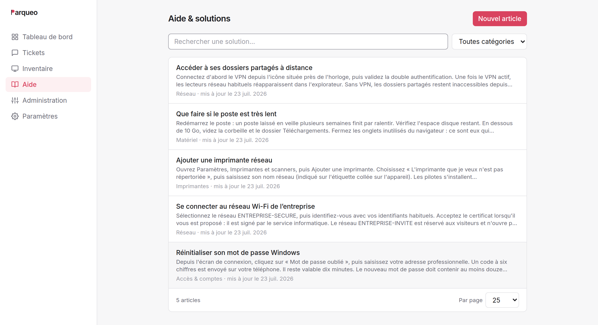
  <figcaption>La base de connaissances. La même recherche alimente les suggestions proposées pendant la saisie d'une demande.</figcaption>
</figure>

---

## 9. L'inventaire du parc

Menu **Inventaire**. Quatre types d'actifs : **PC**, **imprimante**,
**serveur**, **logiciel**.

Chaque actif porte un nom, un type, un emplacement, une date d'achat, un état
(**en service**, **en réparation**, **retiré**) et un utilisateur assigné.

**Fiche d'un actif** : ses caractéristiques et **l'historique des tickets qui le
concernent** — c'est ce qui permet de repérer le poste qui tombe en panne tous
les deux mois.

**Qui voit quoi** : les techniciens et administrateurs voient tout l'inventaire ;
un utilisateur ne voit que le matériel qui lui est assigné, et l'accès peut lui
être coupé entièrement par un paramètre.

**Création et modification** : techniciens et administrateurs.
**Suppression** : administrateurs seulement — et un actif référencé par des
tickets ne peut pas être supprimé. Passez-le en **retiré** : l'historique reste
consultable.

<figure>
  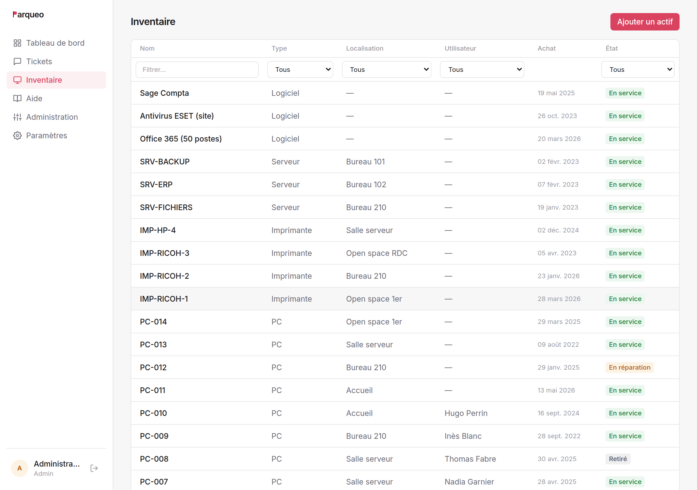
  <figcaption>L'inventaire. Chaque ligne mène à la fiche de l'actif, qui porte l'historique des tickets le concernant.</figcaption>
</figure>

### L'inventaire automatique

Plutôt que tout saisir, le parc peut **remonter tout seul**. Trois moyens,
combinables, mis en place par l'administrateur (voir la documentation
d'installation §6) :

- **Script ou agent GLPI** sur les postes : ils envoient leur configuration
  (matériel, système, logiciels installés) à Parqueo.
- **Connecteur Microsoft Intune** : les appareils déjà gérés dans Intune sont
  récupérés sans rien installer, avec leur utilisateur.
- **Scan réseau SNMP** : les équipements sans agent (imprimantes, switches,
  NAS…) sont découverts en interrogeant le réseau.

Un actif remonté automatiquement porte alors, en plus, une **source** (Agent,
Intune, Scan) et une date de **dernière remontée**. Sa fiche affiche un bloc
**Matériel** (système, processeur, mémoire, stockage) et la liste des
**logiciels installés**. Les champs que vous renseignez à la main (nom,
emplacement, état, utilisateur assigné) sont **respectés** : une remontée
suivante ne les écrase jamais.

**Actifs périmés.** Un équipement automatique qui cesse de remonter est
**signalé en rouge** (« Vu il y a 45 j ⚠ ») au-delà d'un délai réglable
(*Paramètres → Inventaire*). C'est un simple repère : le statut n'est **pas**
modifié. Un actif longtemps silencieux (éteint, retiré, agent en panne) est un
bon candidat à passer manuellement en « retiré ».

### La page Logiciels

Menu **Logiciels** (techniciens et administrateurs) : le catalogue de tous les
logiciels du parc, avec le **nombre de postes** où chacun est installé.
Sélectionner un logiciel liste les machines concernées et leur version — la base
d'un suivi de licences ou de la chasse aux versions obsolètes.

---

## 10. L'administration

Menu **Administration**, réservé aux administrateurs. Cinq onglets.

### 10.1 Utilisateurs

Création, modification, suppression, affectation à une équipe et changement de
rôle. Mot de passe : 8 caractères minimum.

**Import en masse par CSV.** La première ligne donne les en-têtes, avec des
alias acceptés en français : `nom`/`name`, `email`/`e-mail`/`mail`, `role`/`rôle`,
`equipe`/`équipe`/`team`, `mot de passe`/`mdp`/`password`. L'équipe peut être
désignée par son nom.

```csv
nom,email,rôle,équipe
Marc Dupont,marc.dupont@exemple.fr,user,
Sarah Lemoine,sarah.lemoine@exemple.fr,technician,Support IT
```

1000 lignes maximum. Chaque ligne est traitée indépendamment : le rapport
indique les comptes créés, ignorés (déjà présents, ou en double dans le fichier)
et en erreur. **Quand aucun mot de passe n'est fourni, Parqueo en génère un et
l'affiche dans le rapport — c'est le seul moment où il est lisible. Copiez-le
avant de quitter la page.**

<figure>
  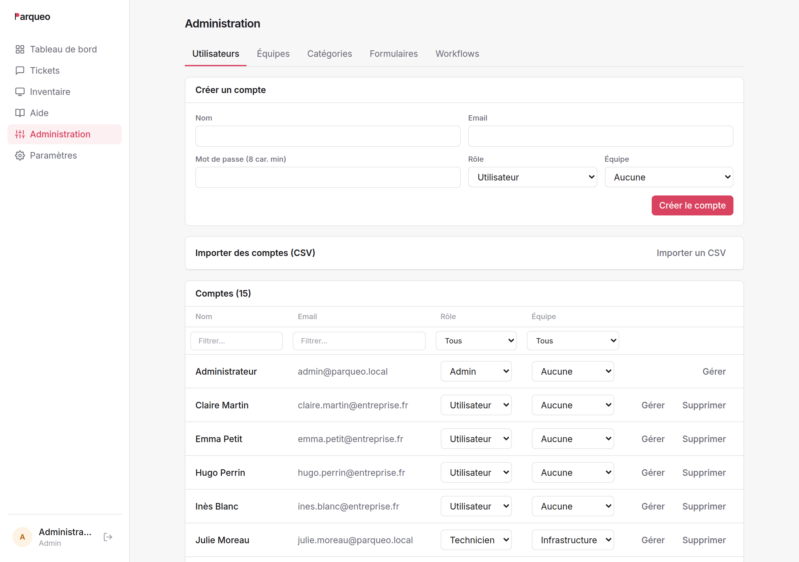
  <figcaption>L'onglet Utilisateurs. Les cinq onglets de l'administration : utilisateurs, équipes, catégories, formulaires et workflows.</figcaption>
</figure>

Deux garde-fous : on ne peut pas retirer son propre rôle d'administrateur, ni
supprimer son propre compte. Un compte qui a écrit des tickets ou des
commentaires ne peut pas être supprimé (l'historique resterait orphelin) —
changez son rôle ou son mot de passe à la place.

### 10.2 Équipes et catégories

Deux listes simples. Les **équipes** regroupent les techniciens et servent à
l'affectation ; les **catégories** classent les tickets, les formulaires et les
articles de la base de connaissances.

Choisissez les catégories avec soin : elles conditionnent les filtres, les
statistiques et le ciblage des workflows.

### 10.3 Formulaires

Construction du catalogue de demandes : nom, description, catégorie, priorité
imposée, activation, et liste de champs ordonnée. Un champ de type liste exige
au moins deux choix.

Un formulaire **désactivé** disparaît du catalogue sans casser les tickets déjà
créés à partir de lui.

À l'édition, **les champs sont remplacés en bloc**. Les tickets existants ne
sont pas affectés : leur contenu a été recopié dans la description à la
soumission.

### 10.4 Workflows

Voir §11.

---

## 11. Les workflows

Un workflow applique une procédure à un ticket, automatiquement. Il se dessine
sur un canvas : un déclencheur, des blocs, des fils entre les blocs.

### 11.1 Déclencheur et filtres

Deux déclencheurs :

- **Un ticket est créé** ;
- **Le statut change**.

On restreint ensuite à ce qui compte : une **catégorie**, un **formulaire
d'origine**, une **priorité**, ou un **statut atteint**. Toutes les conditions
renseignées doivent être vraies. Un workflow par procédure, pas un fourre-tout.

### 11.2 Les blocs

**Actions** — le workflow agit puis passe au bloc suivant :

| Bloc | Effet |
| ---- | ----- |
| Affecter à une équipe | pose l'équipe responsable |
| Assigner à une personne | désigne le technicien |
| Changer la priorité | |
| Changer le statut | |
| Ajouter une note | écrit dans le journal du ticket |
| Envoyer un email | au demandeur, à l'assigné, ou à une adresse fixe |
| Webhook | appelle un outil externe (n8n, Zapier, script maison) |

**Condition** — teste le ticket et ouvre **deux chemins** : la priorité, le
statut, la catégorie, le formulaire d'origine, ou le fait que le ticket soit
déjà pris en charge.

**Attentes** — le ticket **se gare** sur le bloc et ne repart que lorsque la
condition est remplie :

| Bloc | Repart quand |
| ---- | ------------ |
| Attendre la prise en charge | un technicien est assigné |
| Attendre un statut | le ticket atteint le statut choisi |

C'est ce qui sépare une simple règle d'automatisation d'une vraie procédure de
service. Les blocs d'attente ne sont proposés que sur le déclencheur « ticket
créé ».

### 11.3 Variables

Les notes et les emails acceptent des variables entre doubles accolades :

`{{ticket.id}}` · `{{ticket.title}}` · `{{ticket.description}}` ·
`{{ticket.status}}` · `{{ticket.priority}}` · `{{author.name}}` ·
`{{author.email}}` · `{{assignee.name}}` · `{{assignee.email}}` ·
`{{category.name}}` · `{{team.name}}`

Une variable sans valeur est remplacée par du vide.

### 11.4 Exemple complet

**Procédure : incident réseau.**

```
[Ticket créé · catégorie = Réseau]
          │
          ▼
[Affecter à l'équipe Infrastructure]
          │
          ▼
[Envoyer un email au demandeur]
   « Votre demande {{ticket.id}} est prise en compte par le support réseau. »
          │
          ▼
[Attendre la prise en charge]  ◄── le ticket se gare ici
          │
          ▼
[Condition : la priorité est haute ?]
      oui │                     │ non
          ▼                     ▼
[Email à l'astreinte]  [Ajouter une note]
                     « Traitement standard. »
```

<figure>
  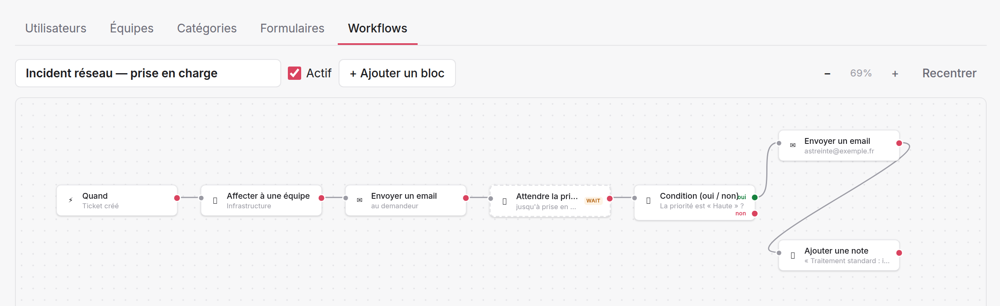
  <figcaption>La même procédure dans l'éditeur. Le bloc d'attente porte la mention <code>WAIT</code> ; la condition a deux points de sortie, <span style="color:#15803d">oui</span> et <span style="color:#d9435f">non</span>.</figcaption>
</figure>

À la création d'un ticket dans la catégorie Réseau : l'équipe est posée, le
demandeur est prévenu, et le ticket attend. Il peut rester garé des heures. Dès
qu'un technicien se l'assigne, le workflow **repart tout seul** au bloc suivant
et évalue la condition.

### 11.5 Bon à savoir

- **Un ticket n'entre qu'une fois dans un workflow donné**, même si l'événement
  se répète.
- **Les actions d'un workflow ne déclenchent jamais un autre workflow.** Pas de
  cascade, pas de boucle.
- **Une action en échec est ignorée** (adresse invalide, équipe supprimée) : le
  workflow continue, et l'échec est écrit dans les journaux du serveur.
- Un workflow **inactif** ne s'applique plus ; les tickets déjà garés sur un de
  ses blocs y restent.
- 30 blocs maximum par workflow.
- **Le webhook** envoie le ticket complet en JSON, avec un jeton secret
  optionnel en en-tête. Il n'attend pas plus de 5 secondes. C'est la porte
  ouverte vers le reste du système d'information : création de compte dans
  l'annuaire, commande de matériel, alerte dans Teams.

---

## 12. Les paramètres

Menu **Paramètres**, administrateurs uniquement. Cinq sections.

<figure>
  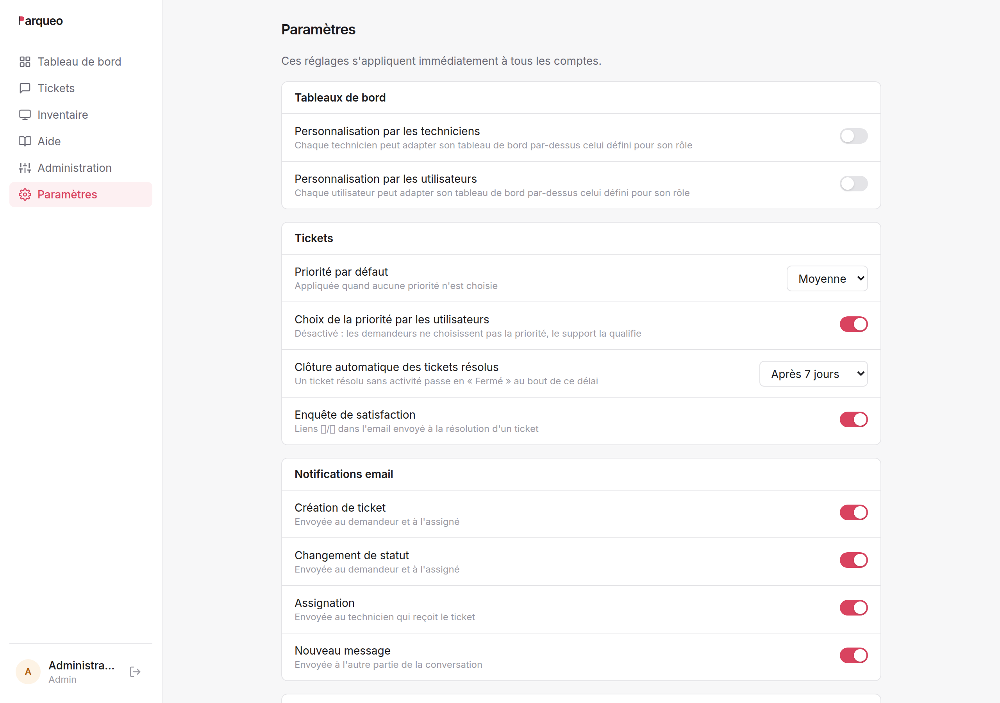
  <figcaption>Les paramètres globaux. Chaque bascule s'applique immédiatement à tous les comptes.</figcaption>
</figure>

### Tableaux de bord

| Paramètre | Défaut | Effet |
| --------- | ------ | ----- |
| Personnalisation par les techniciens | désactivé | ils peuvent composer leur propre tableau de bord |
| Personnalisation par les utilisateurs | désactivé | idem |

### Tickets

| Paramètre | Défaut | Effet |
| --------- | ------ | ----- |
| Priorité par défaut | Moyenne | appliquée quand aucune priorité n'est choisie |
| Choix de la priorité par les utilisateurs | activé | sinon, la priorité par défaut s'impose |
| Clôture automatique des tickets résolus | 7 jours | 0 = désactivée |
| Enquête de satisfaction | activée | liens 👍/👎 dans l'email de résolution |

### Notifications email

| Paramètre | Destinataires |
| --------- | ------------- |
| Création de ticket | demandeur et assigné |
| Changement de statut | demandeur et assigné |
| Assignation | le technicien qui reçoit le ticket |
| Nouveau message | l'autre partie de la conversation |

### Base de connaissances

| Paramètre | Défaut | Effet |
| --------- | ------ | ----- |
| Suggestions à la création de ticket | activées | articles proposés pendant la saisie |
| Rédaction par les techniciens | activée | sinon, les administrateurs seuls |

### Inventaire

| Paramètre | Défaut | Effet |
| --------- | ------ | ----- |
| Inventaire visible par les utilisateurs | activé | désactivé, le menu disparaît pour eux |
| Signaler les actifs périmés | après 30 j | délai sans remontée au-delà duquel un actif automatique est marqué en rouge (statut inchangé) |

---

## 13. Les emails

### 13.1 Ce que Parqueo envoie

| Événement | Destinataires | Contenu |
| --------- | ------------- | ------- |
| Ticket créé | demandeur + assigné | numéro, titre, description, priorité |
| Statut changé | demandeur + assigné | ancien et nouveau statut ; **liens de satisfaction** si passage en Résolu |
| Ticket assigné | le technicien concerné | titre, priorité, demandeur — jamais quand on s'assigne soi-même |
| Nouveau message | l'autre partie | auteur et contenu — jamais à l'auteur du message |

Chacune de ces notifications est désactivable indépendamment.

### 13.2 Ce que Parqueo reçoit

Si le collecteur est activé, l'adresse du support devient une porte d'entrée à
part entière : un email crée un ticket, une réponse à une notification ajoute un
message. Voir §5.3.

---

## 14. Questions fréquentes

**Un technicien me dit qu'il ne voit pas un ticket.**
Il est probablement assigné à un technicien d'une autre équipe. Un technicien
voit ses tickets, ceux de son équipe et ceux qui ne sont assignés à personne.
Réassignez-le, ou passez par un compte administrateur.

**J'ai changé le rôle de quelqu'un, sans effet.**
Le rôle est figé dans la session. Il faut se déconnecter et se reconnecter.

**Un ticket ne bouge plus, sans raison apparente.**
Regardez le panneau latéral : un workflow le retient probablement sur un bloc
d'attente, et l'écran l'indique en clair.

**Je n'arrive pas à supprimer un utilisateur.**
Il a écrit des tickets ou des commentaires ; les supprimer laisserait
l'historique orphelin. Changez son rôle ou son mot de passe pour lui couper
l'accès.

**Je n'arrive pas à supprimer un actif.**
Des tickets le référencent. Passez-le en **retiré** : il disparaît des listes
courantes et l'historique reste consultable.

**Personne ne reçoit d'email.**
Le serveur SMTP n'est probablement pas configuré. Sans lui, Parqueo fonctionne
normalement mais n'envoie rien — voyez avec la personne qui administre le
serveur.

**Un email envoyé au support n'a pas créé de ticket.**
L'expéditeur doit avoir un compte Parqueo. Les adresses inconnues sont ignorées
pour éviter les tickets indésirables.

**Les tickets résolus se ferment tout seuls.**
C'est la clôture automatique, après le délai configuré sans activité. Réglable
et désactivable dans Paramètres.

**Puis-je récupérer un mot de passe généré à l'import ?**
Non. Il n'est affiché qu'une fois, dans le rapport d'import. Ensuite, il faut en
définir un nouveau depuis la fiche de l'utilisateur.
